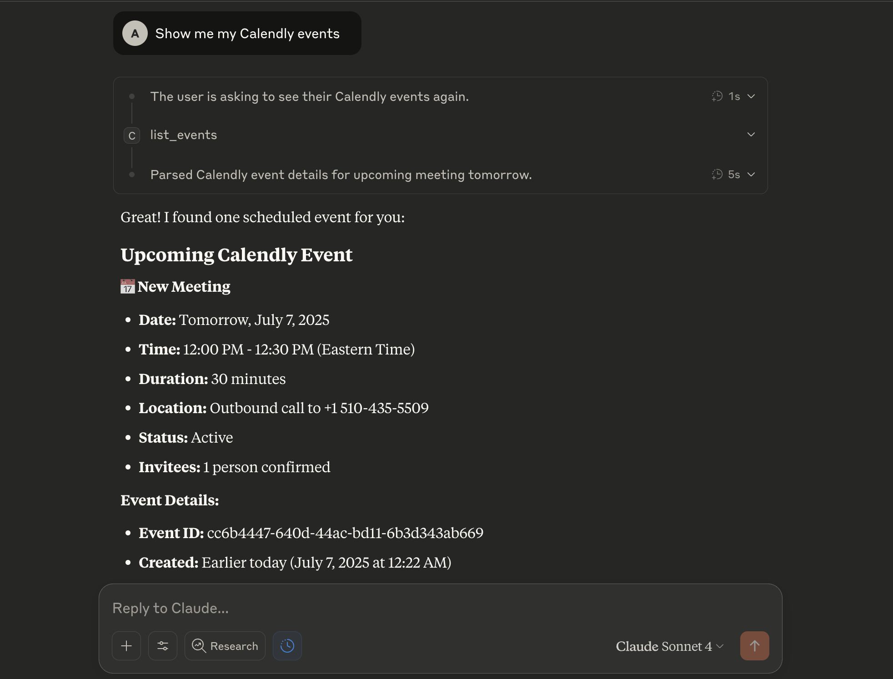

# Calendly MCP Server

A Model Context Protocol (MCP) server for integrating with the Calendly API. This server provides tools to interact with Calendly's scheduling platform, allowing you to retrieve user information, list events, manage invitees, cancel events, and **automatically send professional booking invitation emails**.

## Features

### Core Calendly Integration
- **User Information**: Get current authenticated user details
- **Event Management**: List, retrieve, and cancel scheduled events
- **Invitee Management**: List and manage event invitees
- **Organization**: List organization memberships

### 🆕 Email Integration & Automation
- **Professional Email Invitations**: Send beautiful, branded booking invitation emails
- **End-to-End Workflow**: Create event types and automatically send invitations
- **Multiple Email Providers**: Support for SendGrid, Resend, and SMTP/Nodemailer
- **Custom Templates**: Professional HTML email templates with your branding
- **Personalization**: Automatic host details, meeting info, and booking links

## Installation

### Option 1: NPX (Recommended)
Run directly without installation:
```bash
npx calendly-mcp-server
```

### Option 2: Manual Installation
1. Clone this repository:
```bash
git clone https://github.com/meAmitPatil/calendly-mcp-server.git
cd calendly-mcp-server
```

2. Install dependencies:
```bash
npm install
```

3. Build the project:
```bash
npm run build
```

## Configuration

### Authentication

This server supports two authentication methods:

#### Option 1: Personal Access Token (PAT)
For internal applications or personal use:

1. Get your Personal Access Token from your [Calendly Integrations page](https://calendly.com/integrations)
2. Select **API and webhooks** → **Get a token now**
3. Set the environment variable:
```bash
export CALENDLY_API_KEY="your_personal_access_token_here"
```

#### Option 2: OAuth 2.0
For public applications that multiple users will use:

1. Create a developer account at [developer.calendly.com](https://developer.calendly.com/)
2. Create an OAuth application to get your client credentials
3. Set the environment variables:
```bash
export CALENDLY_CLIENT_ID="your_client_id_here"
export CALENDLY_CLIENT_SECRET="your_client_secret_here"
```

4. Optionally, if you already have tokens:
```bash
export CALENDLY_ACCESS_TOKEN="your_access_token_here"
export CALENDLY_REFRESH_TOKEN="your_refresh_token_here"
```

### Optional User Context (Recommended)

For better performance and automatic defaults, you can set user-specific URIs:

```bash
export CALENDLY_USER_URI="https://api.calendly.com/users/your_user_id"
export CALENDLY_ORGANIZATION_URI="https://api.calendly.com/organizations/your_org_id"
```

These can be obtained by running `get_current_user` after authentication. When set, the server will automatically use these as defaults for API calls that require user context.

### MCP Configuration

Add the server to your MCP client configuration (e.g., Claude Desktop):

#### Option 1: Using NPX (Recommended)

**For Personal Access Token:**
```json
{
  "mcpServers": {
    "calendly": {
      "command": "npx",
      "args": ["calendly-mcp-server"],
      "env": {
        "CALENDLY_API_KEY": "your_personal_access_token_here",
        "CALENDLY_USER_URI": "https://api.calendly.com/users/your_user_id",
        "CALENDLY_ORGANIZATION_URI": "https://api.calendly.com/organizations/your_org_id"
      }
    }
  }
}
```

**For OAuth 2.0:**
```json
{
  "mcpServers": {
    "calendly": {
      "command": "npx",
      "args": ["calendly-mcp-server"],
      "env": {
        "CALENDLY_CLIENT_ID": "your_client_id_here",
        "CALENDLY_CLIENT_SECRET": "your_client_secret_here",
        "CALENDLY_ACCESS_TOKEN": "your_access_token_here",
        "CALENDLY_REFRESH_TOKEN": "your_refresh_token_here",
        "CALENDLY_USER_URI": "https://api.calendly.com/users/your_user_id",
        "CALENDLY_ORGANIZATION_URI": "https://api.calendly.com/organizations/your_org_id"
      }
    }
  }
}
```

#### Option 2: Using Local Installation

**For Personal Access Token:**
```json
{
  "mcpServers": {
    "calendly": {
      "command": "node",
      "args": ["path/to/calendly-mcp-server/dist/index.js"],
      "env": {
        "CALENDLY_API_KEY": "your_personal_access_token_here",
        "CALENDLY_USER_URI": "https://api.calendly.com/users/your_user_id",
        "CALENDLY_ORGANIZATION_URI": "https://api.calendly.com/organizations/your_org_id"
      }
    }
  }
}
```

**For OAuth 2.0:**
```json
{
  "mcpServers": {
    "calendly": {
      "command": "node",
      "args": ["path/to/calendly-mcp-server/dist/index.js"],
      "env": {
        "CALENDLY_CLIENT_ID": "your_client_id_here",
        "CALENDLY_CLIENT_SECRET": "your_client_secret_here",
        "CALENDLY_ACCESS_TOKEN": "your_access_token_here",
        "CALENDLY_REFRESH_TOKEN": "your_refresh_token_here",
        "CALENDLY_USER_URI": "https://api.calendly.com/users/your_user_id",
        "CALENDLY_ORGANIZATION_URI": "https://api.calendly.com/organizations/your_org_id"
      }
    }
  }
}
```

## Available Tools (11 Total)

*All tools work seamlessly through Claude Desktop or any MCP client*

### OAuth 2.0 Tools

#### `get_oauth_url`
Generate OAuth authorization URL for user authentication.

**Parameters:**
- `redirect_uri` (required): The redirect URI for your OAuth application
- `state` (optional): Optional state parameter for security

#### `exchange_code_for_tokens`
Exchange authorization code for access and refresh tokens.

**Parameters:**
- `code` (required): The authorization code from OAuth callback
- `redirect_uri` (required): The redirect URI used in authorization

#### `refresh_access_token`
Refresh access token using refresh token.

**Parameters:**
- `refresh_token` (required): The refresh token to use

### API Tools

#### `get_current_user`
Get information about the currently authenticated user.

#### `list_events`
List scheduled events with optional filtering.

**Parameters:**
- `user_uri` (optional): URI of the user whose events to list (uses `CALENDLY_USER_URI` if not provided)
- `organization_uri` (optional): URI of the organization to filter events
- `status` (optional): Filter by status ("active" or "canceled")
- `max_start_time` (optional): Maximum start time (ISO 8601 format)
- `min_start_time` (optional): Minimum start time (ISO 8601 format)
- `count` (optional): Number of events to return (default 20, max 100)

#### `get_event`
Get details of a specific event.

**Parameters:**
- `event_uuid` (required): UUID of the event to retrieve

#### `list_event_invitees`
List invitees for a specific event.

**Parameters:**
- `event_uuid` (required): UUID of the event
- `status` (optional): Filter by status ("active" or "canceled")
- `email` (optional): Filter by email address
- `count` (optional): Number of invitees to return (default 20, max 100)

#### `cancel_event`
Cancel a specific event.

**Parameters:**
- `event_uuid` (required): UUID of the event to cancel
- `reason` (optional): Reason for cancellation

#### `list_organization_memberships`
List organization memberships for the authenticated user.

**Parameters:**
- `user_uri` (optional): URI of the user (uses `CALENDLY_USER_URI` if not provided)
- `organization_uri` (optional): URI of the organization
- `email` (optional): Filter by email
- `count` (optional): Number of memberships to return (default 20, max 100)

### 🆕 Email Tools

#### `send_booking_invitation`
Send a professional booking invitation email to a recipient.

**Parameters:**
- `to_email` (required): Email address of the recipient
- `to_name` (optional): Name of the recipient
- `event_name` (required): Name of the event/meeting
- `event_duration` (required): Duration in minutes
- `available_days` (required): Array of available days (e.g., ["Monday", "Tuesday"])
- `booking_link` (required): Calendly booking link
- `custom_message` (optional): Personal message to include

#### `create_and_invite_workflow`
**🚀 Complete end-to-end automation:** Create event type, generate booking link, and send invitation email.

**Parameters:**
- `event_name` (required): Name of the event/meeting
- `duration` (required): Duration in minutes
- `availability_days` (required): Array of available days
- `invitee_email` (required): Email address of person to invite
- `invitee_name` (optional): Name of person to invite
- `event_description` (optional): Description of the event
- `custom_message` (optional): Personal message to include

## Usage Examples

Once configured with your MCP client, you can use these tools:

### Live Demo

Here's the MCP server in action with Claude Desktop:



*Example: User asks "Show me my Calendly events" and gets formatted event details including date, time, duration, location, and invitee information.*

### OAuth Flow Examples:
```
# Generate OAuth URL
get_oauth_url redirect_uri="https://myapp.com/auth/callback"

# Exchange code for tokens (after user authorizes)
exchange_code_for_tokens code="AUTHORIZATION_CODE" redirect_uri="https://myapp.com/auth/callback"

# Refresh access token
refresh_access_token refresh_token="REFRESH_TOKEN"
```

### API Examples:
```
# Get current user information
get_current_user

# List recent events
list_events count=10

# Get specific event details
get_event event_uuid="EVENT_UUID_HERE"

# List invitees for an event
list_event_invitees event_uuid="EVENT_UUID_HERE"

# Cancel an event
cancel_event event_uuid="EVENT_UUID_HERE" reason="Meeting no longer needed"
```

### 🆕 Email Examples:
```
# Complete end-to-end workflow (most popular)
create_and_invite_workflow event_name="Client Onboarding" duration=30 availability_days=["Tuesday","Thursday"] invitee_email="client@company.com" custom_message="Looking forward to welcoming you!"

# Send standalone invitation
send_booking_invitation to_email="prospect@startup.com" event_name="Strategy Session" event_duration=45 available_days=["Monday","Wednesday"] booking_link="https://calendly.com/amit/strategy"

# Bulk invitations with custom messages
create_and_invite_workflow event_name="Team Standup" duration=15 availability_days=["Monday","Tuesday","Wednesday","Thursday","Friday"] invitee_email="team@company.com" custom_message="Daily sync to align on priorities"
```

### 🎯 Claude Desktop Examples:
```
# Natural language commands that work in Claude Desktop:
"Create a 30-minute client onboarding call and invite john@company.com"
"Send a booking invitation for a strategy session to sarah@startup.com"
"Schedule a consultation call for Fridays and invite mike@agency.com"
```

## API Limitations

- The Calendly API does not currently support creating new events via API
- Event rescheduling is not supported via API (only cancellation)
- Some endpoints require paid Calendly subscriptions

## Troubleshooting

### NPX Issues
- **"command not found: npx"**: Install Node.js 18+ which includes npx
- **NPX downloads every time**: This is normal behavior; NPX caches packages for faster subsequent runs
- **Permission errors**: Ensure you have write access to npm cache directory (`npm config get cache`)
- **Network issues**: Use `npx --offline calendly-mcp-server` to use cached version

### Authentication Issues
- **"No authentication token available"**: Set `CALENDLY_API_KEY` environment variable
- **400 errors on `list_events`**: Set `CALENDLY_USER_URI` environment variable or provide `user_uri` parameter
- **Permission errors**: Ensure API key has correct permissions

### General Issues
- **TypeScript errors**: Ensure Node.js version 18+ is installed
- **Module not found**: Run `npm run build` if using local installation
- **Email delivery issues**: Check API keys, sender verification, and rate limits

## Development

### Quick Start for Development

```bash
# Test with NPX (recommended for users)
npx calendly-mcp-server

# Test with MCP Inspector
npx @modelcontextprotocol/inspector npx calendly-mcp-server

# Clone for development
git clone <repository-url>
cd calendly-mcp-server
npm install
npm run build
```

### Scripts

- `npm run build`: Build the TypeScript code
- `npm run dev`: Run in development mode with auto-reload
- `npm start`: Run the built server

### Project Structure

```
src/
├── index.ts          # Main server implementation
├── types.ts          # TypeScript type definitions (if needed)
└── utils.ts          # Utility functions (if needed)
```

## Contributing

1. Fork the repository
2. Create a feature branch
3. Make your changes
4. Test thoroughly
5. Submit a pull request

## License

MIT License - see LICENSE file for details.

## Support

For issues with this MCP server, please create an issue in the repository.
For Calendly API documentation, visit the [Calendly Developer Portal](https://developer.calendly.com/).
